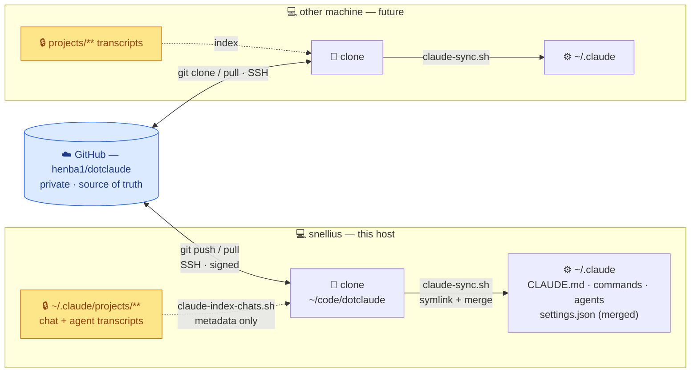

# dotclaude



> **Flow:** config lives in GitHub and flows **down** into each machine's `~/.claude`
> via `claude-sync.sh`; each host's chat **index** flows **up** via
> `claude-index-chats.sh`. 🔒 Transcripts are indexed by *location only* — they never
> leave the host. Git ops use SSH (signed commits); the PAT is read/API only.

Private repo that organizes my [Claude Code](https://claude.ai/code) configuration
across machines. Top level is keyed by **machine**, so each machine's env stays
distinct and browseable — I can read one machine's rules and have Claude re-tailor
them for another (different OS/paths). It is **not** chezmoi: chezmoi *converges*
machines onto one templated source; this keeps them divergent on purpose.

## Layout

```
hosts/<machine>/          # per-machine env (TOP LEVEL = machine names)
  claude/settings.json    #   host-specific settings OVERLAY (e.g. defaultMode)
  env.md                  #   human notes: OS, paths, envs, scheduler
  chats.index.json        #   generated registry of chats on this host (metadata only)
hosts/_template/          # skeleton copied when registering a new machine
settings/settings.base.json   # shared permissions / model / effort
claude-md/                # global instructions + custom tooling (applied to ~/.claude)
  CLAUDE.md  commands/  agents/
templates/                # reusable project-rule snippets (CLAUDE.local.md)
memory/                   # portable memory facts (path-tokenized; adapt per machine)
bin/                      # the sync scripts
```

## What this does and does NOT touch

- **Applied to `~/.claude`** by `bin/claude-sync.sh`: a merged `settings.json`
  (base + host overlay, arrays unioned) and symlinks for `CLAUDE.md`, `commands/`,
  `agents/`.
- **Pull-on-demand, not auto-applied**: `templates/` (copy into a project as
  `CLAUDE.local.md`) and `memory/` (project-coupled, paths baked in — tailor by hand).
- **Never stored here**: auth tokens (`~/.claude/.credentials.json`), app state
  (`~/.claude.json`), and chat transcripts (`~/.claude/projects/**/*.jsonl`). Chats are
  tracked as a metadata **index** only. `.gitignore` enforces this as a backstop.

## Commands, agents & chat locations

- **Slash commands** are plain Markdown in `claude-md/commands/<name>.md` (optional
  YAML frontmatter: `description`, `argument-hint`, `allowed-tools`; body is the prompt,
  `$ARGUMENTS` and `` !`cmd` `` are expanded). Synced as a symlinked dir, so `/<name>`
  works on every machine. Example: `commands/explain-diff.md`.
- **Subagents** are Markdown in `claude-md/agents/<name>.md` with YAML frontmatter
  (`name`, `description`, `tools`, `model`) + a system-prompt body. These are *agent
  definitions*, version-controlled and reusable. Example: `agents/test-runner.md`.
- **Chat/agent transcripts are NOT stored here.** They live machine-locally under
  `~/.claude/projects/<slug>/` (and agent runs under
  `~/.claude/projects/<slug>/<session>/subagents/`). We only record *where* they are:
  `hosts/<host>/chats.index.json` stores each project's `slug`, `cwd`, and
  `transcripts_dir` — a pointer to the dir, not its contents.

## Host identity

`hostname -s` is unreliable on HPC (transient login nodes like `int6`). The stable
host name is resolved as: `--host NAME` arg → `$CLAUDE_HOST` → `~/.config/dotclaude/host`
file → `hostname -s`. `claude-register-host.sh` pins it in the file.

## Onboard a new machine

```sh
git clone git@github.com:henba1/dotclaude.git ~/code/dotclaude
cd ~/code/dotclaude
bin/claude-register-host.sh --host <name>   # scaffold + pin host + build chat index
# review hosts/<name>/env.md and claude/settings.json
bin/claude-sync.sh                          # apply into ~/.claude
git add -A && git commit -m "Register host <name>" && git push
```

Prereqs: `bash`, `jq`, `git`. No root, no extra binaries.

## Day-to-day

```sh
bin/claude-sync.sh            # re-apply after pulling config changes (idempotent)
bin/claude-index-chats.sh     # refresh this host's chats.index.json
```

## Cross-machine tailoring with Claude

Because everything is plain Markdown/JSON in one repo, from any project I can ask
Claude: *"read `hosts/snellius/` and adapt its rules for this macOS box"* — it reads
one host dir and writes another, or drafts a `templates/<x>/CLAUDE.local.md`.
