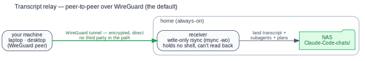
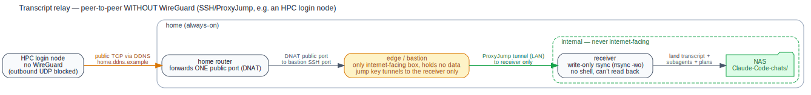

# dotclaude

The **app/logic** for syncing [Claude Code](https://claude.ai/code) across machines. Your
personal content is kept in *separate* repos so this one can be shared/public without
leaking anything:

| Repo | Role | Visibility |
|---|---|---|
| **dotclaude** (this) | scripts, hooks, docs — the logic | public-able |
| **dotclaude-data** | `hosts/`, `settings/`, `claude-md/`, `templates/`, `memory/`, `logs/` | private |
| **claude-chats** | full chat transcripts (`.jsonl`), relayed off each machine | private |


<sub>Diagram source: [`docs/overview.dot`](docs/overview.dot) — `dot -Tsvg docs/overview.dot -o docs/overview.svg`.</sub>

> **Flow:** `dotclaude` (logic) + `dotclaude-data` (your config) → applied into each
> machine's `~/.claude` by `claude-sync.sh`. On `SessionEnd` a hook appends a one-line
> entry to `dotclaude-data/logs/<host>.log` *and* relays the session (transcript, subagents,
> plans) to the NAS via a pluggable backend — peer-to-peer over WireGuard, or `claude-chats`
> on GitHub as a stopgap. Top-level is keyed by machine so envs stay distinct and Claude can
> re-tailor one host's rules for another. The two peer-to-peer transcript paths — over
> WireGuard, and over SSH for machines that can't run it (e.g. HPC) — are drawn out under
> [Transcripts: relay + NAS](#transcripts-relay--nas).

## HOW-TO (start here)

### 0. What is dotclaude?

[Claude Code](https://claude.ai/code) reads its configuration from a `~/.claude/`
directory on whatever machine you run it on: which rules it must follow, which custom
commands and sub-agents exist, what it's allowed to do, and so on. If you work on several
machines (a laptop, a desktop, an HPC cluster) you'd normally set all of that up by hand,
separately, on each one — and they'd drift apart over time.

dotclaude keeps that configuration in **git** instead, and makes it apply itself. This
repo (`dotclaude`) holds only the *machinery* — the shell scripts and hooks. Your actual
content lives in a second, private repo (`dotclaude-data`) that we call **the database**.
A small sync step turns the database into a working `~/.claude/` on each machine, and a
pair of hooks keep it current automatically. The result: you configure Claude once, and
every machine stays in step.

### 1. What's in the database (`dotclaude-data`) and how Claude uses it

The database is just plain Markdown and JSON files, organised into a handful of
directories. Each one feeds Claude in a specific way:

- **`claude-md/`** — the configuration shared by *all* your machines. `CLAUDE.md` is the
  always-on instruction file Claude reads at the top of every session (e.g. *"never add a
  `Co-Authored-By` trailer to commits"*). `commands/` holds custom slash-commands you can
  invoke by name — `commands/explain-diff.md` becomes `/explain-diff`, which might tell
  Claude to summarise your staged git changes. `agents/` holds sub-agents Claude can
  delegate to — `agents/test-runner.md` defines a focused helper that runs your test suite
  and reports back. These three are symlinked straight into `~/.claude/`, so editing a file
  here changes Claude's behaviour everywhere on the next pull.

- **`hosts/<machine>/`** — the part that is *different* per machine. `env.md` describes that
  box in prose (its OS, where Python lives, cluster quirks) so Claude knows the lay of the
  land; `claude/settings.json` holds machine-specific overrides (for example, this HPC node
  auto-accepts edits); `chats.index.json` is an auto-generated catalogue of which chats live
  on that machine. Because hosts sit at the top level, one machine's setup never leaks into
  another's — and you can ask Claude to *"read `hosts/laptop/` and adapt it for this HPC
  box"*.

- **`settings/`** — `settings.base.json` is the baseline `~/.claude/settings.json` that
  applies everywhere: the permission allow/deny lists (which shell commands Claude may run
  without asking), the default model, and which hooks fire. The sync step merges this
  baseline with the per-host overrides from `hosts/<machine>/` into the final settings file.

- **`memory/`** — durable facts Claude has learned and should remember across sessions, one
  fact per file. Claude Code's built-in auto-memory lives per-project at
  `~/.claude/projects/<project>/memory/`; `claude-sync.sh` symlinks each of those into this
  repo under `memory/<host>/<project>/`, so auto-saved memories are synced and sorted by the
  machine they were created on, then by project (mirroring Claude's native layout).

- **`templates/`** — reusable starting points for *project-level* config, kept out of the
  always-on path. A file like `templates/<project>/CLAUDE.local.md` is a ready-made rules
  file you can drop into a specific project so Claude picks up that project's conventions.

- **`logs/`** — a human-readable history of every session, one file per machine
  (`<host>.log`). Each line records the time, machine, working directory, and your first
  prompt, so you can later `grep` for *"that chat about the auth refactor"* across all machines.

- **`runbooks/`** — operational notes for *you* (not Claude), like the plan for moving chat
  transcripts off GitHub onto a private WireGuard link.

### 2. How the system works, and what you set up once

The moving parts fit together like this:

1. **Two repos, one machine-local pointer.** You clone `dotclaude` (this machinery) and
   `dotclaude-data` (your content) onto each machine. A tiny file at
   `~/.config/dotclaude/config` tells the scripts where those clones live, and
   `~/.config/dotclaude/host` pins a stable name for the machine (handy on clusters whose
   hostnames change between logins).

2. **Sync turns the database into `~/.claude/`.** Running `bin/claude-sync.sh` symlinks the
   shared `claude-md/` scopes into `~/.claude/`, points each project's auto-memory dir at the
   synced `memory/<host>/<project>/`, and merges `settings/` + the host overrides into
   `~/.claude/settings.json`. It's safe to re-run; it only changes what actually differs.

3. **Two hooks keep it hands-off.** When a session *starts*, a hook pulls the latest
   `dotclaude-data` and re-runs sync, so config you edited on another machine is already in
   effect. When a session *ends*, a hook appends the log line, refreshes that machine's chat
   index, and commits both back. You don't run these — they run themselves.

**What you actually do once per machine:** clone the two repos, write the little config
pointer, run `claude-register-host.sh` to scaffold a `hosts/<machine>/` entry, then
`claude-sync.sh` to apply it. After that, you only ever *edit files in `dotclaude-data` and
push* — every machine converges on its own. The concrete commands are in
[Onboard a new machine](#onboard-a-new-machine) below.

---

## Layout (this repo — app only)

```
bin/
  onboard.sh             # interactive new-machine setup (deps, clone, config, register, sync, relay key)
  lib.sh                 # shared helpers: host + data/chats pointers
  claude-sync.sh         # apply data-repo config into ~/.claude (symlinks + merged settings)
  claude-index-chats.sh  # write dotclaude-data/hosts/<host>/chats.index.json
  claude-register-host.sh# scaffold a new host into the data repo
  ship-transcript.sh     # relay a session (transcript + subagents + plans + readable render) via the selected backend
  render-transcript.sh   # render a .jsonl as a human-readable Markdown session log (full tool stream)
  backfill-readable.sh   # (one-off) build the readable/ tree for transcripts already on the NAS
  pull-and-mirror.sh     # (Pi) pull claude-chats -> NAS
  onboard-hpc-client.sh  # set up an HPC node to ship over SSH/ProxyJump (no-WG path): key+ssh_config+pointer
  onboard-edge-node.sh   # set up the home edge/bastion (jump user, restricted keys, sshd scope, nft allowlist)
hooks/
  sync-session.sh        # SessionStart hook: pull data repo + claude-sync (auto-fresh config)
  log-session.sh         # SessionEnd hook: log line + refresh index + ship session
  transports/git.sh      # backend: git stopgap (-> claude-chats, Pi mirrors to NAS)
  transports/rsync-wg.sh # backend: peer-to-peer rsync over WireGuard (the NAS receiver)
  transports/local.sh    # backend: local copy (the box that has the NAS mounted)
skeleton/host/           # template copied when registering a new machine
docs/                    # diagrams (overview + transport-wg/-ssh .dot/.svg), raspberry-pi.md, transcript-transport.md
```

## Pointers (machine-local)

The app finds your data/transcript repos via `~/.config/dotclaude/config` (env overrides):

```sh
: "${DOTCLAUDE_DATA:=$HOME/.dotclaude/dotclaude-data}"
: "${DOTCLAUDE_CHATS:=$HOME/.dotclaude/claude-chats}"
: "${DOTCLAUDE_TRANSCRIPT_BACKEND:=git}"
```

Host identity is pinned separately in `~/.config/dotclaude/host` (because `hostname -s`
is transient on HPC login nodes).

## Onboard a new machine

**Fast path — interactive script.** Clone this repo, then run `bin/onboard.sh`. It checks
deps (and offers to install Claude Code if missing), clones the sibling data repos, writes
the machine-local pointer, registers the host and applies config, and — for the `rsync-wg`
backend — optionally generates the dedicated relay SSH key, adds the `claude-receiver`
ssh-alias, and prints the exact `authorized_keys` line to paste on the receiver. It's
re-runnable and every prompt has a default (or preset it via env, e.g. `DOTCLAUDE_BACKEND`):

```sh
git clone git@github.com:<your-gh-user>/dotclaude.git ~/.dotclaude/dotclaude
~/.dotclaude/dotclaude/bin/onboard.sh
```

<details><summary>Manual steps (what the script automates)</summary>

```sh
git clone git@github.com:<your-gh-user>/dotclaude.git      ~/.dotclaude/dotclaude
git clone git@github.com:<your-gh-user>/dotclaude-data.git ~/.dotclaude/dotclaude-data
git clone git@github.com:<your-gh-user>/claude-chats.git   ~/.dotclaude/claude-chats   # if syncing transcripts

mkdir -p ~/.config/dotclaude && cat > ~/.config/dotclaude/config <<'EOF'
: "${DOTCLAUDE_DATA:=$HOME/.dotclaude/dotclaude-data}"
: "${DOTCLAUDE_CHATS:=$HOME/.dotclaude/claude-chats}"
: "${DOTCLAUDE_TRANSCRIPT_BACKEND:=git}"
EOF

~/.dotclaude/dotclaude/bin/claude-register-host.sh --host <name>   # scaffold + pin + index
# review ~/.dotclaude/dotclaude-data/hosts/<name>/
~/.dotclaude/dotclaude/bin/claude-sync.sh                          # apply into ~/.claude
git -C ~/.dotclaude/dotclaude-data add -A && git -C ~/.dotclaude/dotclaude-data commit -m "host <name>" && git -C ~/.dotclaude/dotclaude-data push
```

`~/.dotclaude/` keeps the machinery out of your project workspace; the clone location is
otherwise arbitrary (it's only referenced via the pointer file above).

Prereqs: `bash`, `jq`, `git`, an SSH key on GitHub. No root.

</details>

## Day-to-day — nothing to run by hand

Both housekeeping scripts run automatically via hooks, so you never update anything manually:

| When | Hook | Does |
|---|---|---|
| session **start** | `sync-session.sh` | `git pull --ff-only` **both** repos (data *and* app, so hook/script fixes propagate too), then `claude-sync.sh` — config edited on another machine arrives and applies itself. |
| session **end** | `log-session.sh` | append the log line, refresh `chats.index.json`, then `git add -A` + commit + push the **whole** data repo — `memory/`, `templates/`, host config and all. Nothing needs a manual sync. |

`git add -A` is safe because the data repo's `.gitignore` blocks secrets and transcripts
(`*.credentials*`, `*.jsonl`, `.claude.json`), so those can never be staged.

Symlinked scopes (`CLAUDE.md`, `commands/`, `agents/`, `hooks/`) go live on the pull
alone — `claude-sync.sh` only has real work when `settings.json` changed. You can still run
either by hand (both idempotent); the hooks just mean you don't have to:

```sh
bin/claude-sync.sh         # re-apply config (auto-runs at SessionStart)
bin/claude-index-chats.sh  # refresh this host's chats.index.json (auto-runs at SessionEnd)
```

Escape hatches (env, in `~/.config/dotclaude/config` or inline): `DOTCLAUDE_NOSYNC=1`
(skip the start-of-session pull+sync), `DOTCLAUDE_SYNC_NOPULL=1` (sync without pulling).

## Find a past chat

Every session is logged by the `SessionEnd` hook to `dotclaude-data/logs/<host>.log`
(one line: `time | host | cwd | "first prompt" | session=id`) and pushed, so all
machines' histories are searchable from any clone of the data repo:

```sh
git -C ~/.dotclaude/dotclaude-data pull
grep -i refactor ~/.dotclaude/dotclaude-data/logs/*.log
```

The full transcript (the `.jsonl`) lives in `claude-chats` / on the NAS under
`<host>/<slug>/<session>.jsonl`.

## Transcripts: relay + NAS

`SessionEnd` ships a session's artifacts off the machine via a **pluggable backend**
(`ship-transcript.sh` → `hooks/transports/<backend>.sh`, chosen by
`DOTCLAUDE_TRANSCRIPT_BACKEND`). What rides which path is split by **privacy**:

**Sensitive → peer-to-peer, never a third party.** Full conversation content stays off
GitHub and goes straight to your NAS over your own WireGuard link:

| Artifact | Lands at |
|---|---|
| full transcript (machine-readable) | `<host>/<slug>/<session>.jsonl` |
| subagent transcripts + tool-results | `<host>/<slug>/<session>/` |
| plans | `<host>/plans/<date>_<topic>.md` |
| clean Markdown render (human-readable) | `<host>/readable/<project>/<date>_<topic>__<sid8>.md` |

The NAS holds **two parallel trees per host**. The `.jsonl` tree above is canonical — exact,
machine-readable, the thing you'd resume or feed to a tool. Alongside it, a `readable/` tree
holds the same sessions rendered as Markdown session logs (user + assistant text plus the full
tool stream — each call shows its input, Bash commands verbatim, and the tool's output inline;
only thinking and system/meta lines dropped) — for browsing and manually repeating tasks. It's organised for humans: foldered by **project** (the session's working dir),
each file named `<date>_<topic>__<sid8>.md` where `topic` is the first real prompt slugified.
Rendering happens automatically on every ship (`bin/render-transcript.sh`, additive — it never
touches the `.jsonl`); `bin/backfill-readable.sh` re-renders transcripts already on the NAS.

Plans get the same human-friendly treatment: Claude Code saves each plan under three random words
(`rippling-sprouting-whisper.md`), so on every ship `dc_normalize_plans` (in `bin/lib.sh`) renames
them *in place* to `<date>_<topic>.md` — date from the file's mtime, topic from the plan's first
heading (a leading `Plan:` stripped) — before the `plans/` dir is mirrored. It's idempotent
(already-dated names are left alone), so each machine self-normalizes its own plans going forward.

**Not sensitive → git (`dotclaude-data`, GitHub).** Your rules, `settings`, `memory/`, host
config and `logs/` are low-sensitivity, need merge/history across machines, and must be
reachable to bootstrap a new box — so they ride normal git, not the tunnel. (Memory is
deliberately *not* part of the session relay.)

### The two peer-to-peer paths to your NAS

However a machine reaches home, the sensitive content goes **straight to your NAS and never
touches a third party**. There are two paths; which one a machine uses depends only on
whether it can run WireGuard.

**1. Over WireGuard — the default.** Most machines (laptops, desktops) join your WireGuard
network and rsync the session straight to the receiver:



**2. Without WireGuard — over SSH (e.g. an HPC login node).** Some machines can't use
WireGuard: an HPC cluster typically blocks the outbound UDP it needs. They reach the NAS over
plain SSH instead, hopping through a small internet-facing **edge/bastion** that holds no data
and can only forward to the receiver:



The bastion is the *only* box exposed to the internet; the receiver and NAS stay on the home
network, reachable solely through that one jump. A leaked key still can't get a shell, read
the archive back, or reach anything but the receiver.

**What the no-WireGuard path needs** (the diagram shows placeholders — substitute your own):
- a **DDNS** name (e.g. `home.ddns.example`) so the sender always finds your home even when
  the ISP rotates your public IP;
- **one public TCP port** forwarded on your router to the bastion — the single inbound hole;
- an **edge/bastion** machine (always-on, internet-facing, holds no NAS) whose jump key is
  restricted to *port-forwarding to the receiver only*, no shell;
- the **receiver** (the NAS box) authorizes that same key as a write-only
  `command="rrsync -wo …",restrict` line;
- `rsync ≥ 3.2.3` on both ends.

`bin/onboard-hpc-client.sh` (on the sender) and `bin/onboard-edge-node.sh` (on the bastion)
configure both ends; the private `runbooks/wireguard-transcripts.md` is the full walk-through.

**Backends** — one file each, defining `transport_ship <src> <relpath>` (`src` may be a file
*or* a directory):
- **`local`** — the box that *has* the NAS mounted copies straight in, no network hop. Set
  `DOTCLAUDE_LOCAL_CHATS` to the NAS chats root.
- **`rsync-wg`** — every other machine rsyncs over WireGuard to the receiver. Set
  `DOTCLAUDE_WG_TARGET` + `DOTCLAUDE_WG_SSHKEY`.
- **`git`** — stopgap: push to `claude-chats`, a Pi mirrors to the NAS
  ([`docs/raspberry-pi.md`](docs/raspberry-pi.md)).

**P2P requirements** (the `rsync-wg` path):
- the sender can reach the receiver (the NAS box) over WireGuard;
- a **per-machine** SSH key (`DOTCLAUDE_WG_SSHKEY`), authorized on the receiver as a
  **write-only** `command="rrsync -wo …",restrict` line — a leaked key can't read the archive
  back, get a shell, or forward;
- `rsync ≥ 3.2.3` on both ends (for `--mkpath`).

Full design + the WireGuard activation runbook:
[`docs/transcript-transport.md`](docs/transcript-transport.md) and (private)
`dotclaude-data/runbooks/wireguard-transcripts.md`.

## Useful commands

Day-to-day this all runs from hooks; reach for these when you want to do something by hand.
Paths assume the default `~/.dotclaude/` layout from [Onboard](#onboard-a-new-machine)
(if you cloned elsewhere, adjust, or run `bin/*` from inside the repo).

**Apply / refresh config now** (normally automatic at session start/end):
```sh
~/.dotclaude/dotclaude/bin/claude-sync.sh           # re-apply data-repo config into ~/.claude
~/.dotclaude/dotclaude/bin/claude-sync.sh --force   # also back up + replace real (non-symlink) files
~/.dotclaude/dotclaude/bin/claude-index-chats.sh    # rebuild this host's chats.index.json
```

**Pull the latest from your other machines** (the SessionStart hook does both for you):
```sh
git -C ~/.dotclaude/dotclaude-data pull             # config, rules, memory, templates, logs
git -C ~/.dotclaude/dotclaude      pull             # the scripts & hooks themselves
```

**Find a past chat** across every machine:
```sh
git -C ~/.dotclaude/dotclaude-data pull
grep -i <keyword> ~/.dotclaude/dotclaude-data/logs/*.log
```

**Register the current machine** (first-time onboarding):
```sh
~/.dotclaude/dotclaude/bin/claude-register-host.sh --host <name>
```

**Toggle behaviour without editing files** — set in `~/.config/dotclaude/config` (persistent)
or inline before a command (one-off):

| Env var | Effect |
|---|---|
| `DOTCLAUDE_TRANSCRIPT_BACKEND=off` | pause session shipping (other values: `local`, `rsync-wg`, `git`) |
| `DOTCLAUDE_NOSYNC=1` | skip the start-of-session pull + sync entirely |
| `DOTCLAUDE_SYNC_NOPULL=1` | sync at start but don't `git pull` first |
| `DOTCLAUDE_NOSHIP=1` | end the session without shipping its transcript |
| `DOTCLAUDE_LOG_NOGIT=1` | append the log line but don't commit/push it |

**Re-home the dotclaude clones** (move the machinery, e.g. out of `~/code` into `~/.dotclaude`):
```sh
mkdir -p ~/.dotclaude
mv ~/code/dotclaude ~/code/dotclaude-data ~/code/claude-chats ~/.dotclaude/

# repoint the machine-local pointer at the new location
cat > ~/.config/dotclaude/config <<'EOF'
: "${DOTCLAUDE_DATA:=$HOME/.dotclaude/dotclaude-data}"
: "${DOTCLAUDE_CHATS:=$HOME/.dotclaude/claude-chats}"
: "${DOTCLAUDE_TRANSCRIPT_BACKEND:=git}"
EOF

~/.dotclaude/dotclaude/bin/claude-sync.sh   # rebuild the ~/.claude symlinks at the new path
```
`claude-sync.sh` recomputes the app location from its own path and re-links every scope, so
nothing else needs touching. Confirm with
`readlink -e ~/.claude/{CLAUDE.md,commands,agents,hooks}` (no dangling links). The pinned host
name in `~/.config/dotclaude/host` is unaffected. This is machine-local — nothing to commit.

## Troubleshooting

**Hooks only activate on the *next* session.** `claude-sync.sh` (and `onboard.sh`, which runs
it) install the hooks — symlinking `~/.claude/hooks` and registering them in
`~/.claude/settings.json`. But Claude reads its hooks **at session start**, so a `claude`
instance that was *already running* when you onboarded won't see them: its `SessionStart`
already fired, with no hooks to load. **Quit and reopen `claude`** after onboarding — only
sessions started afterwards run `SessionEnd` (the transcript/subagents/plans relay + log/index
push). This is the usual reason a freshly-onboarded machine "ships nothing".

- **`SessionEnd` triggers on both `/exit` and `/clear`** (the latter then starts a fresh
  session). Either way, a session that began *before* the hooks were active won't ship.
- **"SessionEnd hook … Hook cancelled":** Claude cancels hooks that haven't returned by the
  time the session process exits. `log-session.sh` detaches its network work (git push +
  relay) so shutdown can't interrupt it — just ensure the machine has pulled the app repo
  (`git -C <app-clone> pull`; `SessionStart` does this automatically next time).
- **Expecting `memory/` on the NAS?** Memory isn't relayed — it rides the `dotclaude-data`
  git sync, not the session relay (see [Transcripts: relay + NAS](#transcripts-relay--nas)).

## Cross-machine tailoring with Claude

Everything is plain Markdown/JSON, so from any project you can ask Claude: *"read
`dotclaude-data/hosts/<other>/` and adapt its rules for this box"* — it reads one host's
config and writes another's.
