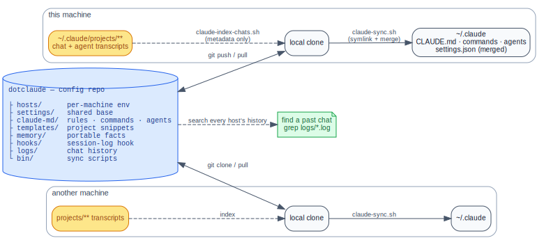

<div align="center">


[](LICENSE)
[](https://henba1.github.io/scrubjay/)
[](https://opencode.ai)
[](https://claude.ai/code)
[](#)

</div>

# scrubjay

The **app/logic** for syncing [Claude Code](https://claude.ai/code) across machines —
one configuration, applied to every machine, with each session's records relayed to your
own NAS. Your personal content is kept in *separate* repos so this one can be
shared/public without leaking anything:

| Repo | Role | Visibility |
|---|---|---|
| **scrubjay** (this) | scripts, hooks, docs — the logic | public-able |
| **scrubjay-data** | `hosts/`, `settings/`, `claude-md/`, `shared/`, `opencode/`, `templates/`, `memory/`, `logs/` | private |
| **scrubjay-chats** | full chat transcripts (`.jsonl`), relayed off each machine | private |



<sub>Diagram source: [`docs/overview.dot`](docs/overview.dot) — `dot -Tsvg docs/overview.dot -o docs/overview.svg`.</sub>

> **Flow:** `scrubjay` (logic) + `scrubjay-data` (your config) → applied into each
> machine's `~/.claude` by `claude-sync.sh`. On `SessionEnd` a hook appends a one-line
> entry to `scrubjay-data/logs/<host>.log` *and* relays the session (transcript, subagents,
> plans) off the machine via a pluggable backend — either peer-to-peer to your own NAS (over
> WireGuard), or to a private `scrubjay-chats` repo on GitHub if you'd rather not run storage of
> your own. Top-level is keyed by machine so envs stay distinct and Claude can re-tailor one
> host's rules for another.

## The core idea: two kinds of sync

Everything scrubjay moves is one of two things — and which one it is decides the *mechanism*:

| Semantic | Mechanism | What it fits |
|---|---|---|
| **Shared / bidirectional** — same content everywhere, edits *merge* | **git** (pull + push) | things you *author*: `CLAUDE.md`, `commands`, `agents`, `settings`, **memory** |
| **Archive / one-way** — machine → NAS, never read back | **rsync** (peer-to-peer) | *records*: transcripts, subagents, plans, `readable/`, history |

The orthogonal axis is **privacy**: anything sensitive goes straight to your own NAS, never a
third party. In one sentence — **author-vs-record picks git-vs-rsync; sensitive-vs-not picks
NAS-vs-GitHub.** The full design is in [Concepts](https://henba1.github.io/scrubjay/concepts/).

## Quick start

**No fork needed.** Clone this repo straight from upstream — it's the app, and it updates itself
by `git pull`. Your *content* lives in private repos under your **own** GitHub account, which the
onboarder creates for you (`scrubjay-data`, plus `scrubjay-chats` on the `git` backend).

**With Claude Code** — clone, open Claude in the clone, and ask it to set things up. It reads
[`AGENTS.md`](AGENTS.md), gathers your choices, and drives the onboarder:

```sh
git clone git@github.com:henba1/scrubjay.git ~/.scrubjay/scrubjay
cd ~/.scrubjay/scrubjay && claude
# then: "set up scrubjay on this machine"
```

**By hand** — run the interactive onboarder directly:

```sh
git clone git@github.com:henba1/scrubjay.git ~/.scrubjay/scrubjay
~/.scrubjay/scrubjay/bin/onboard.sh          # asks for your GitHub account (or set SCRUBJAY_OWNER)
```

It creates and seeds your private repos, writes the machine-local pointer, registers the host,
applies config, and (for the peer-to-peer backends) prints one `authorized_keys` line to paste on
the receiver — the single manual step, by design.

Prereqs: `bash`, `jq`, `git`, an SSH key on GitHub, and the [`gh`](https://cli.github.com) CLI to
create the private repos (without it, the onboarder prints the exact `gh repo create` commands and
stops). No root. Install with `git clone`, **not** a source tarball — the app self-updates by
pulling, so an unpacked archive can never update itself. Full walkthrough:
[Onboarding](https://henba1.github.io/scrubjay/onboarding/).

## Documentation

Full docs — [**henba1.github.io/scrubjay**](https://henba1.github.io/scrubjay/):

- [**Concepts**](https://henba1.github.io/scrubjay/concepts/) — the two-kinds-of-sync model and what lives in the database.
- [**Onboarding**](https://henba1.github.io/scrubjay/onboarding/) — install on a new machine, the repo layout, and machine-local pointers.
- [**Day-to-day**](https://henba1.github.io/scrubjay/day-to-day/) — the hooks that keep it hands-off, finding a past chat, troubleshooting.
- [**Query the archive (MCP)**](https://henba1.github.io/scrubjay/archive-mcp/) — recall a past session by *topic* from inside a live Claude session.
- [**Slash commands**](https://henba1.github.io/scrubjay/slash-commands/) — the `/dc*` command reference.
- [**Transcripts: relay + NAS**](https://henba1.github.io/scrubjay/transports/) — the peer-to-peer paths (WireGuard / SSH) to your own NAS.
- [**Reference**](https://henba1.github.io/scrubjay/reference/) — the by-hand command cheatsheet and environment toggles.

The docs also publish an [`llms.txt`](https://henba1.github.io/scrubjay/llms.txt) index for agents.

## License

[MIT](LICENSE) © 2026 Hendrik
