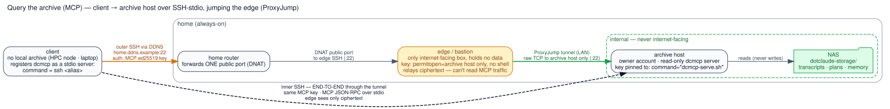

# Query the archive (MCP)

`grep`-ing the logs finds a chat by a word you remember typing. The harder case — *"I discussed
X **somewhere** a while ago, which machine was it even on?"* — is what the **`sjmcp`** MCP server
solves: a **read** path back into a live session over everything the relay already wrote
(transcripts, plans, cross-machine memory, notes), so you can recall a past session by *topic* and pull
it — or just the relevant slice — straight into context without leaving Claude.

It's a single-file, **read-only** server (`mcp/sjmcp_server.py`, run via `uv run --script`) that
reads the same storage pointers as the rest of scrubjay (`SCRUBJAY_LOCAL_CHATS`,
`SCRUBJAY_MEMORY`, `SCRUBJAY_DATA`). Recall is deliberately **embedding-free** — a fast ripgrep
prefilter (grep fallback) surfaces candidate snippets and the in-session model does the semantic
ranking — so there's no index to build and nothing sensitive ever leaves the NAS. Each `sj_recall`
enumerates the archive **once** and resolves every candidate's metadata from that single pass, so
cost scales with the size of the archive rather than the number of matches — it stays snappy as the
corpus grows (a NAS-mounted archive of ~100+ sessions recalls in tens of milliseconds). It also folds the
`logs/<host>.log` **session catalogue** into recall: a topic match there links to the transcript
when present, or stands alone as a "you had this on `<host>`" pointer — so recall spans even
sessions whose full transcript isn't on the machine you're asking from. It exposes:

| Surface | What |
|---|---|
| **tools** | `sj_list` (browse w/ filters, incl. `type=log` for the catalogue), `sj_recall` (topic → ranked candidates + anchors), `sj_search_within` (a topic *inside* one session → turn/line anchors), `sj_get` (fetch an artifact or a `turns=`/`lines=` slice), `sj_status` |
| **resources** | every transcript/plan/memory/note as an `@`-pickable resource (`sj://transcript/…`, `sj://plan/…`, `sj://memory/…`, `sj://note/…`) with a human, date-sorted title |
| **commands** | `/sjrecall <topic>`, `/sjfind <topic> in <session>`, `/sjbrowse [type]`, `/sjget <ref>` — thin wrappers that drive the tools (full list under [Slash commands](slash-commands.md)) |

## How recall ranks — and what the numbers mean

`sj_recall` scores candidates lexically and hands the shortlist to the model, which does the actual
semantic ranking. The score is `10 ×` distinct query terms matched, plus `6 ×` the terms that
**co-occur within one 10-line passage**, plus `8` if the session's catalogue line matched, plus the
raw hit count capped at `6`. Coverage still dominates; the passage term is what stops a long session
that merely *mentions* every word from outranking the short one that answers the question, and the
capped hit count keeps repetition from driving rank at all. Each result carries a `why`
(`"6/7 terms · 5 in one passage · catalogue line"`) so the ordering is legible rather than magic.

Snippets are chosen the same way: deduped by line, densest first, and spread at least 20 lines
apart, so four slots show four parts of the transcript instead of four views of one paragraph.

Two contracts worth knowing, because they save a full fetch:

- **A snippet's `line` is a 1-based line number in that result's `path`** — the same numbering
  `sj_get(lines="670-700")` uses. Pad it by ~20 lines and fetch the passage, not the file.
  (Snippets marked `"source": "log"` come from the catalogue, not the file, and carry no line.)
- **The two search tools take different query languages.** `sj_recall` splits on whitespace and
  ORs the terms, each a case-insensitive substring, dropping terms of ≤2 characters.
  `sj_search_within` takes **one literal substring** — no regex, no alternation — so a multi-term
  query there returns a truthful but misleading `matches: 0`.

### A pointer is not a miss

The archive is host-keyed, and the `logs/` catalogue spans every machine — so a session id can be
real, known, and simply not here. `sj_get` / `sj_search_within` say which:

```json
{"error": "no transcript in this archive", "sid": "a2626749", "host": "laptop",
 "date": "2026-07-24", "cwd": "…", "hint": "transcript not in this archive — recall it on laptop"}
```

Same wording `sj_recall` puts on its `type=log` results. `"not found or outside the archive"` keeps
its narrower meaning: no such thing, anywhere.

## Registration is automatic, three ways

All done by `claude-sync.sh` at **user scope**, picked by what this machine has:

- **On a GitHub (`git` backend) machine** — the `scrubjay-chats` clone *is* the archive: the relay
  writes the same `<host>/{readable,plans,…}` tree into it that a NAS holds, so `claude-sync.sh`
  registers a local stdio server pointed straight at the clone. `sync-session.sh` `git pull`s the
  clone at the start of each session, so recall spans **every** machine's sessions, not just this
  one's. No NAS, WireGuard, or SSH — nothing to authorize. (Cross-machine *memory* recall rides its
  own repo, not `scrubjay-chats` — enable it with `/sjmemory`, which points it at a separate private
  `scrubjay-memory` GitHub repo for this backend; transcripts, plans, and the logs catalogue work out of
  the box. See [memory](memory-sync.md) for the custody trade-off.)
- **On the archive host** (the always-on home server where `SCRUBJAY_LOCAL_CHATS` → the NAS is
  mounted): a local stdio server reads the mounted archive directly. Nothing to do beyond onboarding.
- **On a client with no local archive** (a laptop, or an **HPC login node**): run
  `bin/onboard-mcp-client.sh` (offered by `onboard.sh`). It points `SCRUBJAY_MCP_REMOTE` at the
  archive host and registers an `ssh` entry; on connect, a forced command (`bin/sjmcp-serve.sh`) runs
  the server **on the archive host** and pipes MCP stdio back over the same SSH/ProxyJump path the
  relay uses. The server side stays a manual `authorized_keys` authorize (printed by the script),
  like the relay + memory keys. **One mechanism covers both kinds of client:** a laptop on the
  WireGuard mesh, *and* an HPC login node that can't join it — clusters typically block the outbound
  UDP that WireGuard needs, so those nodes fall back to plain SSH/ProxyJump instead. If neither path
  applies, `claude-sync.sh` prints a loud, actionable skip rather than silently doing nothing.

## The remote transport (SSH-stdio)

A client with no local archive registers `sjmcp` as a *stdio* server whose command is
`ssh <alias>`. That SSH **jumps the edge/bastion** (ProxyJump) to reach the archive host on the
home LAN, where a forced command launches the read-only server; MCP JSON-RPC rides the pipe. The
clever bit is the **two nested SSH sessions**: an *outer* one authenticates to the edge (whose key
is restricted to forwarding a single port — no shell), and an *inner*, **end-to-end** session runs
through that tunnel to the archive host. So the edge only ever relays opaque ciphertext — it can't
read or tamper with the MCP traffic. Auth is asymmetric (an `ed25519` key, verified at both hops);
the tunnel itself is the usual symmetric SSH channel.



<sub>Diagram source: [`transport-mcp.dot`](transport-mcp.dot) — `dot -Tsvg docs/transport-mcp.dot -o docs/transport-mcp.svg`. Placeholder DDNS name + default ports; substitute your own.</sub>

## The same channel also serves session hand-off

`bin/sjmcp-serve.sh` dispatches on `$SSH_ORIGINAL_COMMAND`, so the one pinned forced command answers
three things:

| `$SSH_ORIGINAL_COMMAND` | Serves |
|---|---|
| *(empty)* | the MCP stdio server — recall/search/get, i.e. everything on this page |
| `resolve <sid>` | `<relpath> <lines> <mtime>` for every archived copy of a session |
| `fetch <relpath>` | a tar stream of that archive entry (file or directory) |

The two extra verbs exist so a machine on the **write-only** `rsync-wg` relay can pull a whole
session back down for `claude --resume` ([session hand-off](handoff.md)) without the transcript having
to cross the client's context window to reach its disk. They grant this key nothing new — it can
already hand out the same raw `.jsonl` via `sj_get(format="raw")`. Both verbs re-check the resolved
path against the archive root (so a symlink inside the archive is not a way out), and anything else
is refused.

## The one manual step — authorize the client on the archive host

`onboard-mcp-client.sh` does everything on the client, then prints the exact line(s) to install by
hand (the server side is never automated — same rule as the relay + memory keys). Each key is
pinned to the read-only server and nothing else:

- **On the archive host**, add to the **owner account**'s `~/.ssh/authorized_keys` (the account with
  `uv` + the scrubjay clone + archive read — *not* the write-only relay account). The forced command
  confines the key to the one server, so a leaked key can only run read-only archive queries:

  ```
  command="<abs-path-to-clone>/bin/sjmcp-serve.sh",restrict <the printed public key>
  ```

- **If the path crosses a ProxyJump edge/bastion** (e.g. an HPC client), also add to the jump user's
  `~/.ssh/authorized_keys` **on the edge** — letting the key tunnel only to the archive host's port,
  run nothing:

  ```
  restrict,port-forwarding,permitopen="<archive-host>:<port>",command="/bin/false" <the printed public key>
  ```

Then verify from the client — `ssh <mcp-alias> </dev/null && echo OK` (first run is slow once while
`uv` resolves deps on the archive host, then caches). sjmcp activates on the next Claude session.
